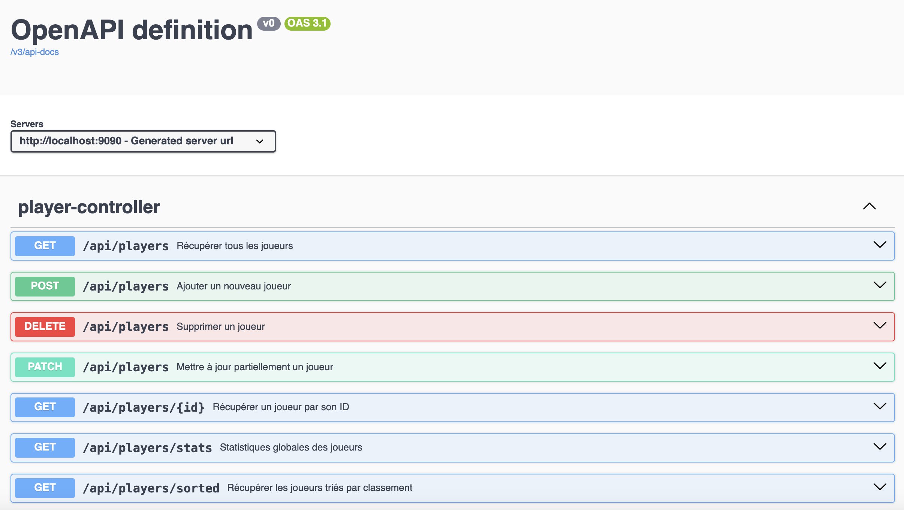

# Atelier API - Sullivan Sextius

Cette application Spring Boot est une API REST de gestion de joueurs, avec documentation Swagger intégrée. Elle expose plusieurs endpoints CRUD ainsi que des routes de statistiques.

---



## 🔧 Prérequis

- Java 21
- Maven 3.8+
- (Optionnel) IDE recommandé : IntelliJ IDEA ou VS Code

---

## 🚀 Démarrer l'application

### 1. Cloner le projet

```bash
git clone https://github.com/ton-utilisateur/atelier-api-sullivan-sextius.git
cd atelier-api-sullivan-sextius
```

### 2. Lancer l’application

```bash
./mvnw spring-boot:run
```

Ou via un IDE :

- Ouvre la classe `AtelierApiSullivanSextiusApplication.java`
- Clique sur "Run"

Par défaut, l’API sera accessible à l’adresse :  
📍 `http://localhost:8080` (en local)
📍 `https://app-atelier-api-sse.herokuapp.com/` (en production)

---

## 📚 Documentation Swagger

Une fois l’application démarrée, accède à Swagger UI :

🔗 `http://localhost:8080/swagger-ui/index.html`

Tu pourras tester toutes les routes directement via l’interface.

---

## Endpoints principaux
Voici les différentes routes à tester pour l'API :

| Méthode | Endpoint                                   | Description                           |
|---------|--------------------------------------------|-------------------------------------|
| GET     | [ `/players`](https://app-atelier-api-sse-17cc7a059d18.herokuapp.com/api/players)          | Récupérer tous les joueurs           |
| GET     | [ `/players/{id}`](https://app-atelier-api-sse-17cc7a059d18.herokuapp.com/api/players/{id}) | Récupérer un joueur par son ID       |
| POST    | [ `/players`](https://app-atelier-api-sse-17cc7a059d18.herokuapp.com/api/players)          | Ajouter un nouveau joueur            |
| PATCH   | [ `/players`](https://app-atelier-api-sse-17cc7a059d18.herokuapp.com/api/players)          | Mettre à jour partiellement un joueur|
| DELETE  | [ `/players`](https://app-atelier-api-sse-17cc7a059d18.herokuapp.com/api/players)          | Supprimer un joueur                  |
| GET     | [ `/players/stats`](https://app-atelier-api-sse-17cc7a059d18.herokuapp.com/api/players/stats)    | Statistiques globales des joueurs    |
| GET     | [ `/players/sorted`](https://app-atelier-api-sse-17cc7a059d18.herokuapp.com/api/players/sorted)  | Récupérer les joueurs triés          |

---

## Lancer les tests

### 🧪 Tests unitaires et d’intégration

Lance tous les tests avec Maven :

```bash
mvn test (Commande à lancer à la racine du projet)
```

Maven exécutera automatiquement :

- Les tests **unitaires** (souvent avec des mocks)
- Les tests **d’intégration** (chargement du contexte Spring)

---

## 📁 Structure du projet (extrait)

```
src
├── it  # Tests d'intégration

├── main
│   └── java/com/example/atelier_api_sullivan_sextius/
│       ├── controller/ 
│       ├── dto/
│       └── entity/
│       ├── exceptions/
│       ├── handler/
│       ├── service/
│       └── storage/
│       └── wrapper/

└── test
    └── java/com/example/atelier_api_sullivan_sextius/
        ├── service/          # Tests unitaires
        ├── storage/          # Tests unitaires

```

---
## Description des dossiers

    controller/
    Contient les classes qui exposent les endpoints REST. Elles reçoivent les requêtes HTTP, appellent les services et renvoient les réponses.

    dto/
    Regroupe les Data Transfer Objects, des objets légers utilisés pour transférer des données entre client et serveur, souvent adaptés pour l’API.

    entity/
    Contient les classes représentant les entités métier, souvent liées aux objets métiers de l'application  (ex : Player).

    exceptions/
    Regroupe les classes d’exceptions personnalisées, pour gérer les erreurs spécifiques de l’application.

    handler/
    Contient les gestionnaires d’exceptions globaux (ex : classes annotées avec @ControllerAdvice) ou autres handlers spécifiques.

    service/
    Contient la logique métier de l’application.

    storage/
    Regroupe les classes responsables de la persistance des données.

    wrapper/
    Contient la classe qui permet de mapper les données de l'application

## Accéder à Swagger UI

Une fois l'application démarrée, accède à la documentation interactive de l’API à l’adresse suivante :

👉 http://localhost:8080/swagger-ui.html

    🔄 Redirection : si cette URL ne fonctionne pas, essaye aussi :

        http://localhost:8080/swagger-ui/index.html

        http://localhost:8080/v3/api-docs (JSON brut de l’API)

## Deployé l'application avec docker

### Prérequis
- Installer [Docker](https://docs.docker.com/get-docker/)

### Netoyer le packge maven
mvn clean package (si la commande n'existe pas installer directement maven) ==>  https://maven.apache.org/download.cgi (windows) / Tapez la commande suivante brew install maven (sur Mac) puis réessayez


### Créé l'image docker
docker build -t spring-atelier-api-sse .

### Créer le conteneur et lancez l'imafe
docker run -p 9090:8080 spring-atelier-api-sse

## Déploiement Héroku

Image docker disponible sur Heroku voici le lien :

## Auteur

Sullivan Sextius

📧 sullivan.sextius@gmail.com | coding.vibes.officiel@gmail.com

Futur maître du web sur Youtube (n'hésite pas a t'abonner pour voir mon évolution) : 

## Youtube
https://www.youtube.com/@CodingVibesOfficiel

## Linkledin
https://www.linkedin.com/in/sullivan-sextius-8394ba163/

## Tiktok
https://www.tiktok.com/@codingvibesofficiel